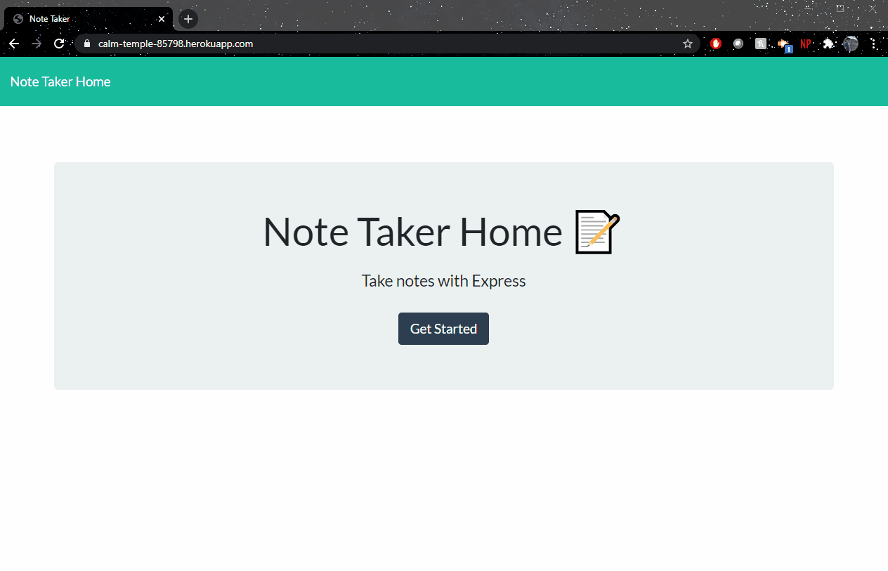
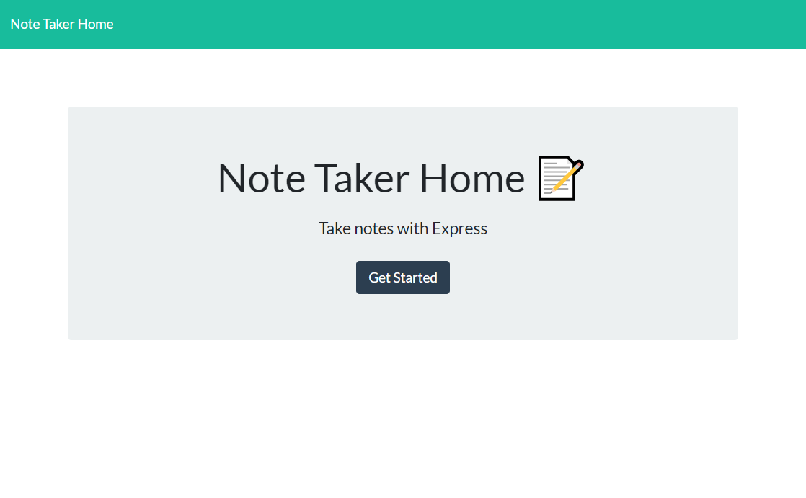
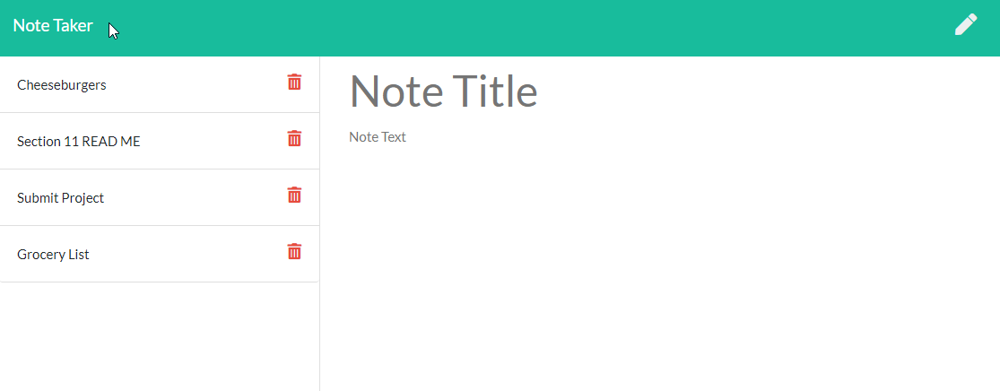
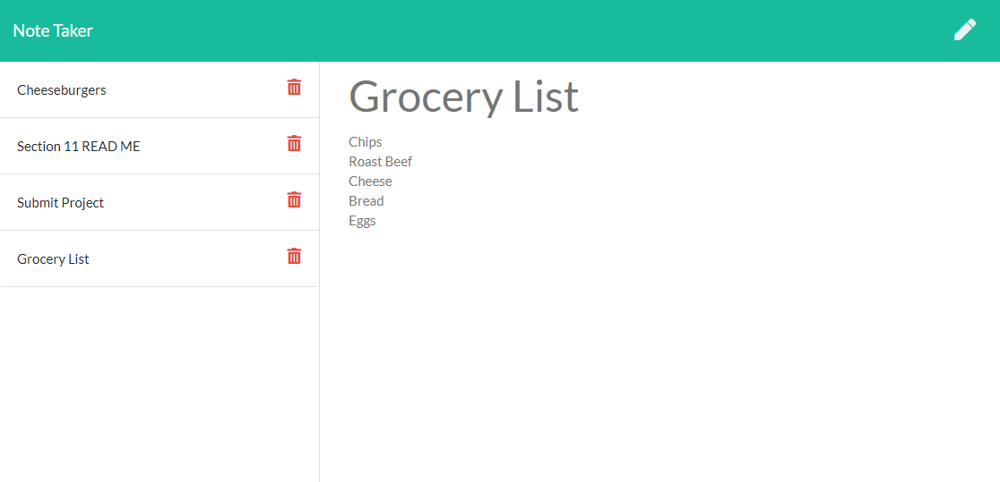

# Note Tracker

#### Table of Contents
  * [Description](#Description)
  * [Installation](#Installation)
  * [Screenshots](#Screenshots)
  * [Credits](#Credits)
  * [License](#License)

## Description
Use this application to keep track of your to-dos or to jot down your thoughts. 
Note-Tracker reads, writes, and deletes notes from `./Develop/db/db.json` by using `./Develop/routes/apiRouting.js` for routing. HTML pages are presented to the user via `./Develop/routes/htmlRouting.js`. 

Click [Here](https://calm-temple-85798.herokuapp.com/) to view the Heroku deployment.
 
## Installation
#### Technologies Used
* HTML
* JavaScript
* [Bootstrap](https://getbootstrap.com/)
* [Node](https://nodejs.org/en/) and [npm](https://www.npmjs.com/package/npm)
* [Visual Studio Code](https://code.visualstudio.com/)
* [cmder](https://cmder.net/)

#### Steps
* Start by entering the following in your terminal: `Git clone https://github.com/whackingMUFN/Note-Tracker.git`

* Change directory to `Note-Tracker/Develop` and enter `npm install` into your terminal. This will install all package dependencies.

* Add node_modules to .gitignore.

* Start the application by running `node server.js`

## Screenshots
#### Note Tracker Tour

#### Home Page
 

#### New Note Template
 

#### View Created Notes

## Credits
This assignment was provided by Trilogy Education Services. Files `server.js`, `apiRouting.js`, and `htmlRouting.js` were created based on in class activities and lectures, [MDN](https://developer.mozilla.org/en-US/) Reference Documents for JavaScript syntax [JSHint](https://jshint.com/) for JavaScript validation, and various other online resources. 
## License

[License](https://github.com/whackingMUFN/Homework/WeekFive/LICENSE.txt)
MIT &copy; 2020 Calvin Freese
